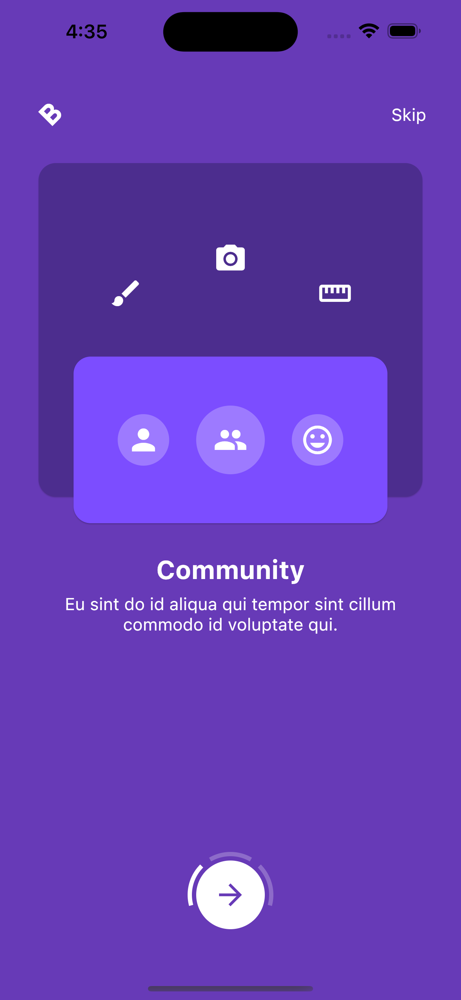
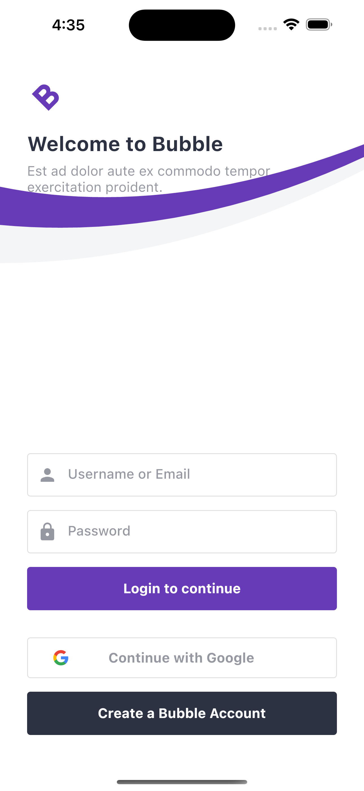

# 🔥🔥 Flutter Onboarding And Login Page (Bubble App -Temp)

<h1 align="center">
  Justicetech
</h1>

Flutter project for creating animated onboarding and login screen.

Star⭐ the repo if you like what you like more stuff on flutter 😉.

## ✨ Requirements
* Any Operating System (ie. iphonwMacOS X, Linux, Windows)
* Any IDE with Flutter SDK installed (ie. IntelliJ, Android Studio, VSCode etc)
* A little knowledge of Dart and Flutter.

## Some Screenshots For You 💖

|
  
